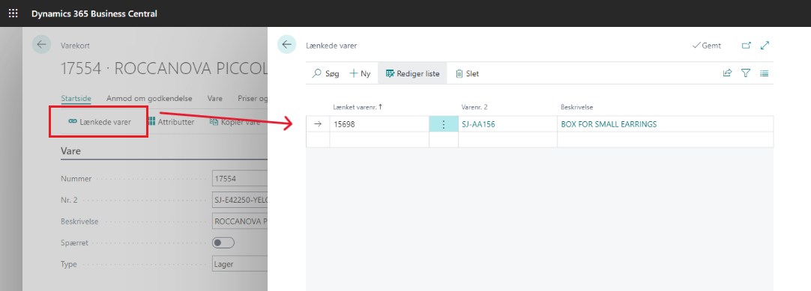

# Lænkede varer

Når salgsordrer fra Shopify frigives, oprettes der linjer med lænkede varer. 

På den enkelte varer kan man sætte op hvilke varer, der skal være lænkede og dermed tilføjes på ordren når den frigives.

